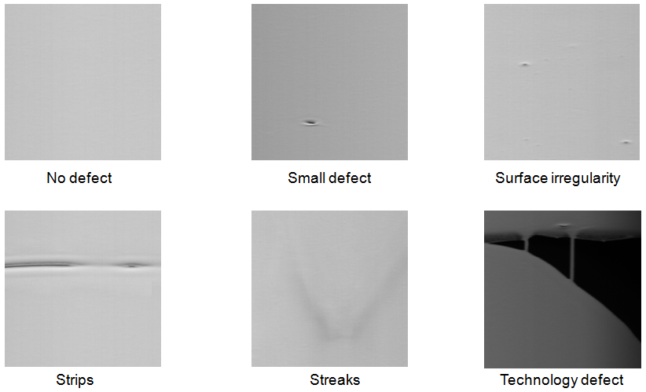
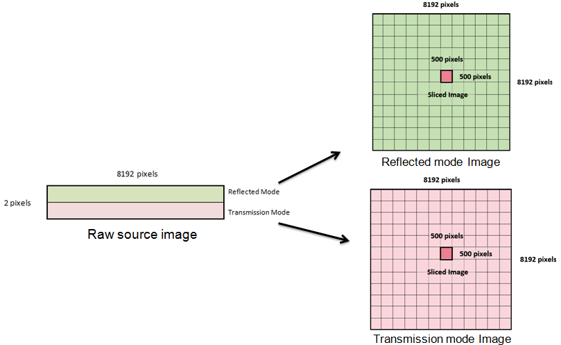
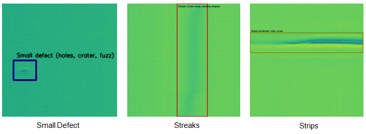
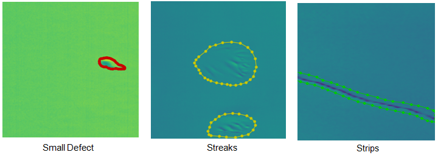
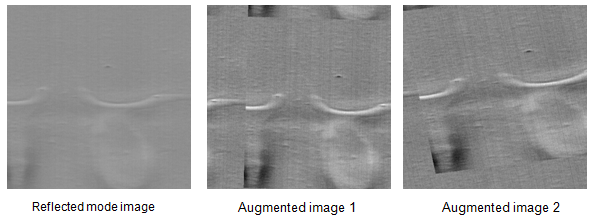

# Deep-Learning-for-Online-Defect-Detection-in-a-Ceramic-Tape-Casting-Process
### Contents of Thesis
1. Motivation
2. Aims and Objectives
3. Methodology
4. Results 
5. Conclusion

## 1. Motivation

## 2. Aims & Objectives

To develop a Neural Network algorithm for pattern recognition in ceramic tape reflected mode images based on category of defect. Category of defect in ceramic tape images includes
* No Defect,
* Small Defect,
* Strips,
* Streaks,
* Surface Irregularities,
* Technology Defect.

Sample images for category of defects in ceramic tape images are shown below.

### Objectives

The aim of the thesis is achieved by the following objectives.

1. Collecting high-resolution ceramic tape image data of 2 x 8192 pixels dimensions and slicing it into smaller image dimensions of 500 x 500 pixels in Python.
2. Converting the ceramic tape image data into a labeled dataset.
3. Creating training routine for different neural network architectures in Python using Keras and TensorFlow.
4. Training different neural network architectures on labeled ceramic tape dataset for binary classification.
5. Selecting better performing model from binary classification results and training them on ceramic tape dataset for multi-classification.
6. Evaluation of architecture performance for binary classification and multi-classification.

## 3. Methodology
#### 3.1 Data Collection
Raw image data collected from line camera is of dimension 2 x 8192 pixels. High resolution image data include images of moving ceramic tape in reflected mode and transmission mode. In a single experiment of ceramic tape casting, 50 m (approx.) of ceramic tape is produced and 300,000 (approx.) high resolution images are collected. High resolution reflected mode images of dimension 8192 x 8192 are created by stitching reflected mode array and transmission mode array from the raw source image in sequence. Large reflected mode images of dimension 8192 x 8192 pixels are sliced into smaller 500 x 500 pixels images as shown in the figure below.

#### <strong>Advantages of slicing over resizing</strong>
* Utilize high- resolution image data, no loss of pixel data.
* Small defect cover significant pixel area of image. 
  * Image size is reduced , defect size remains unchanged.
* Small defect has higher chances to be detected.
* Able to broadly localize the defect in the images.
* Get more images for training.

#### 3.2 Data Labeling

#### Bounding Box Labeling
Total 7647 images are labeled with six categories of defect. Labeled images used to train encoder models. Image labeling tool named **“Label-studio”** is used.
Examples for bounding box labeled images are shown below.

#### Pixel-wise labeling
Total 1004 images are labeled with four categories of defect. Labeled images used to train auto encoder models. Image labeling tool named **“LabelMe”** is used.
Examples for pixel labeled images are shown below.

#### 3.2 Data Augmentation

Image Augmentation is used as pre-processing technique. Increases total training images by adding variation in training dataset. Augmentations are added in series during training are Brightness, Rotation, Skew, Zoom, Horizontal flip ,Vertical flip, Width shift and Height shift. Examples of augmented images shown in image below.

