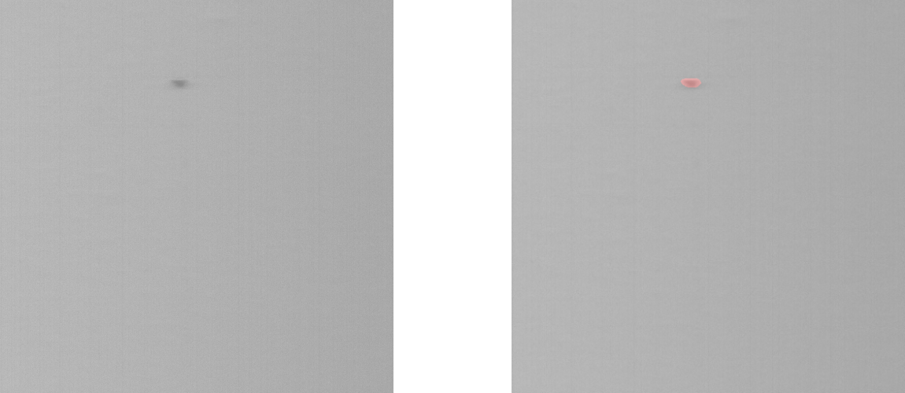
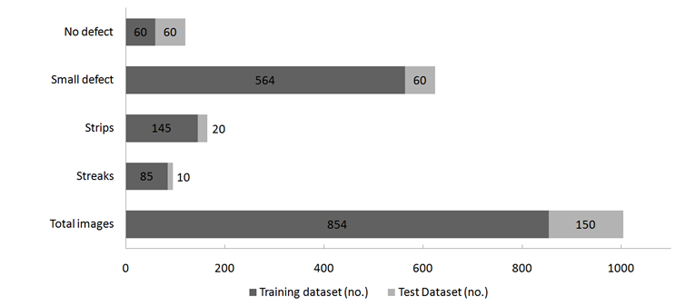

# Deep-Learning-for-Online-Defect-Detection-in-a-Ceramic-Tape-Casting-Process
### Table of Contents
1. Examples of Predictions by U-Net (with EfficientNetB3 as encoder)
2. Aims and Objectives
3. Methodology
4. Results 
5. Conclusion
6. How to use the code.

## 1. Examples of Predictions by U-Net (with EfficientNetB3 as encoder)
U-Net model (with EfficientNetB3 as encoder) is trained to classify multiple defects (i.e. four classes of defects) in Ceramic tape images. In examples shown below , model make predictions on test images and create a mask over the defect area and classify the defect. Images on left are original test images and images on right contain the model predictions. Color of masks and category of defects predicted by the model are mention below.

* Streak defect - Brown mask
* Strips defect - Sky blue mask
* Small defect -  Red mask
* No defect - invisible mask

### 1. Model Prediction for Streaks defect

### 2. Model Prediction for Strips defect

### 3. Model Prediction for Small defect

## 2. Aims & Objectives

Develop a Neural Network algorithm for pattern recognition in ceramic tape reflected mode images based on category of defect. Category of defect in ceramic tape images includes
* No Defect,
* Small Defect,
* Strips,
* Streaks,
* Surface Irregularities,
* Technology Defect.

Sample images for category of defects in ceramic tape images are shown below.

### Objectives

The aim of the thesis is achieved by the following objectives.

1. Collecting high-resolution ceramic tape image data of 2 x 8192 pixels dimensions and slicing it into smaller image dimensions of 500 x 500 pixels in Python.
2. Converting the ceramic tape image data into a labeled dataset.
3. Creating training routine for different neural network architectures in Python using Keras and TensorFlow.
4. Training different neural network architectures on labeled ceramic tape dataset for binary classification.
5. Selecting better performing model from binary classification results and training them on ceramic tape dataset for multi-classification.
6. Evaluation of architecture performance for binary classification and multi-classification.

## 3. Methodology
#### 3.1 Data Collection
Raw image data collected from line camera is of dimension 2 x 8192 pixels. High resolution image data include images of moving ceramic tape in reflected mode and transmission mode. In a single experiment of ceramic tape casting, 50 m (approx.) of ceramic tape is produced and 300,000 (approx.) high resolution images are collected. High resolution reflected mode images of dimension 8192 x 8192 are created by stitching reflected mode array and transmission mode array from the raw source image in sequence. Large reflected mode images of dimension 8192 x 8192 pixels are sliced into smaller 500 x 500 pixels images as shown in the figure below.

#### <strong>Advantages of slicing over resizing</strong>
* Utilize high- resolution image data, no loss of pixel data.
* Small defect cover significant pixel area of image. 
  * Image size is reduced , defect size remains unchanged.
* Small defect has higher chances to be detected.
* Able to broadly localize the defect in the images.
* Get more images for training.

#### 3.2 Data Labeling

#### Bounding Box Labeling
Total 7647 images are labeled with six categories of defect. Labeled images used to train encoder models. Image labeling tool named **“Label-studio”** is used.
Examples for bounding box labeled images are shown below.

#### Pixel-wise labeling
Total 1004 images are labeled with four categories of defect. Labeled images used to train auto encoder models. Image labeling tool named **“LabelMe”** is used.
Examples for pixel labeled images are shown below.

#### 3.3 Data Augmentation

Image Augmentation is used as pre-processing technique. Increases total training images by adding variation in training dataset. Augmentations are added in series during training are Brightness, Rotation, Skew, Zoom, Horizontal flip ,Vertical flip, Width shift and Height shift. Examples of augmented images shown in image below.

#### 3.4 Neural Network Model Training
* Training routines for different architectures are developed in Python using Keras and TensorFlow.
* Selected architectures are trained by taking advantage of Transfer Learning Technique. (i.e.  pre-trained ImageNet weights are used as their initial weights for model training.)
* Architectures performances are evaluated in form of their predictions on test dataset defined as “Test Accuracy”.
* Three experiment for each selected architecture is conducted with random distribution of Train Test split of images. (with constant Train Test split ratio of 90% -10% )

## 4. Results
#### 4.1 Binary Classification
Binary Classification Image distribution - 1152 bounding box labeled images with Train-Test distribution of 90% -10% ratio are used.

Different Neural Network Architectures are selected for binary classifiation experiments. List of architectures are mentioned below.
* ResNet (No Augmentated data)
* ResNet
* Inception V3
* XceptionNet
* InceptionResNetV2
* EfficientNet

Overall results for Binary Classification experiments are mentioned below.

#### 4.2 Multi Classification
Multi Classification Image distribution for **Encoder Models**- 1735 bounding box labeled images with Train-Test distribution of 90% -10% ratio are used.

Multi Classification Image distribution for **U-Net Models** - 1004 pixel labelled images with Train-Test distribution of 90% -10% ratio are used.

Three best performing models from Binary classification experiments along with U-Net architecture models are selected for the multi classification experiments. List of architectures are mentioned below.
* ResNet101
* XceptionNet
* EfficientNetB5
* U-Net (with ResNet101 as encoder)
* U-Net (with EfficientNetB2 as encoder)
* U-Net (with EfficientNetB3 as encoder)

Overall results for Multi Classification experiments are mentioned below.

## 5. Conclusion
1. High resolution ceramic tape image data of dimension 2 x 8192 pixels is converted into 500 x 500 pixels reflected mode and transmission mode ceramic tape images.
2. Sliced reflected mode are converted into labeled dataset based on category of defect.
 * Total 7647 bounding box labeled images.
 * Total 1004 pixel labeled images.
3. **Training routine** for selected architectures is set up in Python using Keras and TensorFlow.
4. Selected architectures are trained for **binary classification** experiments and  three best performing models based on Average Maximum Test Accuracy of are selected.
5. Three best performing models from binary classification experiments along with U-Net architecture with different encoders are trained for **multi- classification** experiments.

## 6. How to use the code

The repository contains training routine for Encoder Models and U-Net models

### Encoder Models

<b>XceptionNet_binary.py</b> and <b>EfficientNetB5_binary.py</b> can be modified for multi-classification and to import other architectures available in Keras. To use the script on custom dataset, images need to be placed in data directory and seperate sub-directories need to be created for each category inside data directory.

To run these scripts TensorFlow 2.0+ is required. Other parameters that need to be changed while modifying the scripts are

a) Training And Test Data Paths

b) Image dimensions

c) Intensity of Image Augmentation

d) Learning rate (Constant learning rate is used in XceptionNet_binary.py. Whereas Two-stage training i.e. pre-training and post-training with different learning rates in two different stages are used in EfficientNetB5_binary.py. The learning rate value needs to be changed in the learning rate scheduler function with epoch values.)

e) Epochs (Epoch value need to be changed in 2 places in EfficientNetB5_binary.py as the model is trained in 2 stages)

f) Number of the data points in the x-axis for creating the graph. (same as Epochs) 

### U-Net Models

<b>Seg2.py</b> is used to train the model and can be modified to create different U-Net architectures with standard architectures as backend. In Seg2.py Segmentation-model library is used to create U-Net architecture and compile with the combination of focal loss and dice loss with metrics to measure performance used are F1 score and IOU score. Training routine can be modified for the 2 stage training. And learning rate values can be changed in the learning rate scheduler function with epoch values.

<b>Data_generator_new.py</b> and <b>Data_generator_valid_new.py</b> responsible for generating training data and validation data for the training routine and can be modified.

<b>Seg22.py</b> can be used to train the model for further epochs by importing the H5 file for model weights as initial weights.

<b>Predict.py</b> can be modified to make predictions for the saved model for Test images.

<b>Environment_conda_windows.yml</b> is an anaconda environment file consists of list of libraries required to run the U-Net scripts in windows.

To run the script TensorFlow 1.15.0 is required. Other parameters that need to be changed while modifying the scripts are

a) Training And Test Data Paths (in Seg2.py and Seg22.py)

b) Image dimensions (in Data_generator_new.py)

c) Intensity of Image Augmentation (in Data_generator_new.py)

d) Learning rate (in Seg2.py and Seg22.py)

